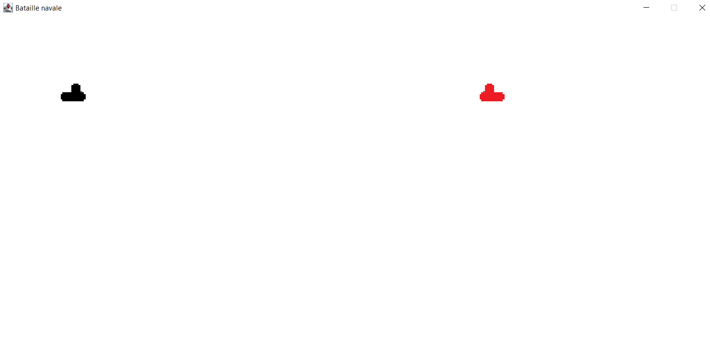

# Jeu Bataille Navale


```
git clone https://github.com/come83/SousMarin1.0.git
```


### Description

Projet développé en Java ou deux joueur peuvent s'affronter 
sur le même clavier.

### But du jeu

Les joueurs peuvent tirer des torpilles, le premier
à toucher l'autre gagne.



### Règles

* Commandes :
    * Joueur Gauche :
        * Z --> Haut
        * Q --> Gauche
        * D --> Droite
        * S --> Bas
        * Space --> Tirer 
    * Joueur Droit :
      * numPadHaut --> Haut
      * numPadGauche --> Gauche
      * numPadDroit --> Droite
      * numPadBas --> Bas
      * Ctrl --> Tirer
  
* Un joueur ne peut tirer qu'une seule torpille à la fois
* Un joueur peut tirer derrière lui seulement horizontalement
* Un joueur peut tirer face à lui horizontalement, et à 45° en haut et en bas 
* La direction de la torpille dépend de la dernière direction du sous marin

## Configurations utilisées :

* Java 1.8.0
* IntelliJ 11.0.12

